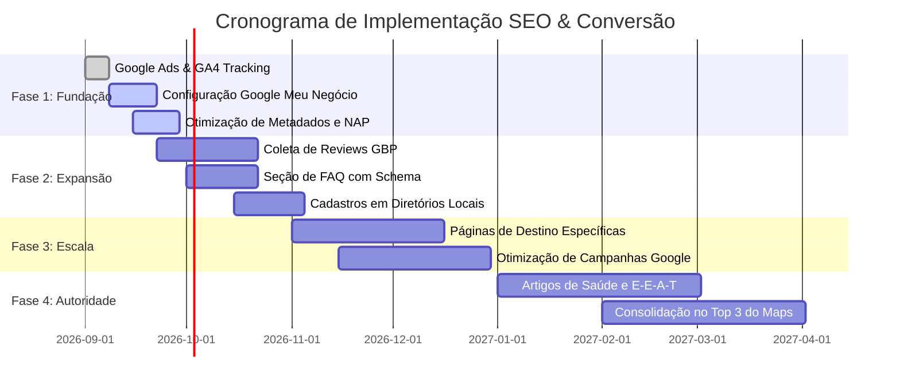

# Plano Estratégico de SEO & Aquisição Digital
## Dra. Larissa Ramos — Fisioterapia Especializada
**Localização:** Canasvieiras, Florianópolis - SC  
**Domínio:** [larissaramos.com.br](https://www.larissaramos.com.br/)  
**Última Atualização:** Setembro de 2026  
**Documento de Referência:** Estratégia de SEO Local para Negócios de Saúde e Serviços

---

## 1. Perfil do Negócio & Diagnóstico Inicial

### 1.1 Identidade e Posicionamento
- **Especialista:** Dra. Larissa Ramos
- **Especialidades:** Fisioterapia Ortopédica, Terapia Manual, Reabilitação de Coluna, Pós-Operatório, Fisioterapia Esportiva e Atendimento Domiciliar (Home Care).
- **Endereço Físico:** Rod. Tertuliano Brito Xavier, 210 - Canasvieiras, Florianópolis - SC, CEP 88054-000.
- **Contato / Agendamentos:** Telefone / WhatsApp: (48) 99103-3490.
- **Raio de Atendimento Primário:** Canasvieiras, Jurerê Internacional, Jurerê Tradicional, Cachoeira do Bom Jesus, Ponta das Canas, Ingleses, Vargem Grande, Santo Antônio de Lisboa e Norte da Ilha.
- **Comportamento do Usuário:** 
  - Alta urgência para quadros álgicos agudos (ex: "travei a coluna", torcicolos, dor ciática).
  - Alto valor percibido e busca por confiança técnica para pós-operatórios e dores crônicas.
  - Conversão mobile-first imediata via **WhatsApp** e ligação direta.

### 1.2 Status Técnico Atual do Site
- **Tecnologia:** React 19 + TypeScript + Vite + Tailwind CSS v4.
- **Performance:** Excelente (renderização rápida, imagens em formato WebP, responsivo).
- **Dados Estruturados:** JSON-LD `MedicalClinic` já implementado no `index.html`.
- **Rastreamento:** Google Ads (`AW-11211091548`) e suporte a Google Analytics 4 (GA4) com disparo de conversões nos botões de contato e formulário.

---

## 2. Análise Competitiva & Mercado Local (Florianópolis / Norte da Ilha)

### 2.1 Cenário Competitivo
Em Florianópolis e especificamente no Norte da Ilha, as clínicas concorrentes se dividem em:
1. **Grandes Policlínicas e Clínicas Convênio:**
   - Pontos fortes: Volume de páginas e autoridade de domínio antigo.
   - Pontos fracos: Atendimento impessoal ("fisioterapia em grupo"), pouca ênfase em terapia manual individualizada, tempos longos de espera e baixa taxa de conversão direta.
2. **Consultórios Individuais e Studios de Pilates:**
   - Pontos fortes: Proximidade com o paciente local.
   - Pontos fracos: Sites desatualizados, lentos, sem marcação de dados Schema.org, sem foco em palavras-chave específicas de dor e reabilitação, perfis do Google Meu Negócio mal configurados.

### 2.2 Oportunidades Identificadas (Gaps de Conteúdo)
- **Buscas por Sintoma + Bairro:** A maioria dos concorrentes foca apenas no termo genérico "fisioterapia florianopolis". Existe um oceano azul em termos como:
  - *"fisioterapia canasvieiras"*
  - *"fisioterapia jurere internacional"*
  - *"fisioterapia para coluna norte da ilha florianopolis"*
  - *"fisioterapeuta pos operatorio canasvieiras florianopolis"*
  - *"terapia manual florianopolis canasvieiras"*
  - *"fisioterapia domiciliar norte da ilha florianopolis"*
- **Prova Social e Avaliações Reais:** Pacientes decidem com base em depoimentos detalhados de casos de sucesso (alívio da dor, recuperação de cirurgia).

---

## 3. Matriz de Palavras-Chave & Intenção de Busca

### 3.1 Intenção Transacional / Local de Alta Urgência (Foco Imediato)
| Palavra-Chave | Volume Estimado | Intenção | Prioridade |
|---|---|---|---|
| fisioterapia canasvieiras | Médio / Alto | Transacional / Local | **P1 (Crítica)** |
| fisioterapeuta em canasvieiras florianopolis | Médio | Transacional / Local | **P1 (Crítica)** |
| clinica de fisioterapia norte da ilha florianopolis | Médio | Transacional / Local | **P1 (Crítica)** |
| fisioterapia jurere | Médio | Transacional / Local | **P1 (Crítica)** |
| fisioterapia ingleses florianopolis | Alto | Transacional / Local | **P2** |
| fisioterapia domiciliar florianopolis norte da ilha | Médio | Transacional / Serviço | **P1 (Crítica)** |
| terapia manual florianopolis | Médio | Transacional / Especialidade | **P1 (Crítica)** |

### 3.2 Intenção de Tratamento & Sintoma (Problem-Aware)
| Termo de Pesquisa | Problema do Paciente | Solução Oferecida |
|---|---|---|
| tratamento hérnia de disco canasvieiras | Dor irradiada, perda de mobilidade | Descompressão, terapia manual, exercícios clínicos |
| dor na coluna lombar o que fazer | Crise aguda de lombalgia | Avaliação imediata e alívio de dor |
| reabilitação lca florianopolis | Pós-cirúrgico de ligamento | Protocolo acelerado com segurança motora |
| fisioterapia para bursite e tendinite | Dores crônicas nos ombros e quadril | Terapia manual, liberação tecidual e fortalecimento |
| fisioterapia para idosos a domicilio | Dificuldade de locomoção de familiares | Home Care com equipamentos portáteis |

---

## 4. Otimização do Google Meu Negócio (GBP) — Padrão 2026

O Google Business Profile é o **fator #1 de atração de novos pacientes** para serviços de saúde locais. As buscas do "Local 3-Pack" do Google Maps convertem mais de 60% dos pacientes da região.

### 4.1 Consistência Rígida de NAP (Name, Address, Phone)
O nome, endereço e telefone devem ser **idênticos** em todas as fontes (Site, Google Maps, Doctoralia, Redes Sociais, Apple Maps):
- **Nome:** Dra. Larissa Ramos - Fisioterapia Especializada
- **Endereço:** Rod. Tertuliano Brito Xavier, 210, Canasvieiras, Florianópolis - SC, 88054-000
- **Telefone:** (48) 99103-3490
- **Website:** https://www.larissaramos.com.br/

### 4.2 Categorias Primárias e Secundárias
- **Categoria Primária:** Fisioterapeuta (*Physical therapist*)
- **Categorias Secundárias:**
  - Clínica de fisioterapia (*Physical therapy clinic*)
  - Clínica de reabilitação (*Rehabilitation center*)
  - Terapeuta manual (*Alternative medicine practitioner / health consultant*)

### 4.3 Checklist de Diretrizes 2026 do Google Maps
1. **Horário de Funcionamento em Tempo Real:** "Aberto agora" tornou-se um dos 5 maiores fatores de ranqueamento no algoritmo local. Manter horários precisamente sincronizados (Seg-Sex: 08h às 20h).
2. **Botão de WhatsApp Integrado:** Conectar diretamente o número comercial `+5548991033490` como canal preferencial de mensagens do perfil.
3. **Estratégia de Avaliações (Review Stories):** 
   - Solicitar a cada paciente após alta ou melhora expressiva um review detalhado mencionando o problema tratado (ex: *"Tinha uma dor lombar insuportável e após o tratamento com a Dra. Larissa voltei a treinar..."*). 
   - As palavras contidas nos comentários de clientes no GBP afetam diretamente o ranking orgânico do Maps para esses termos.
   - Responder 100% das avaliações em menos de 24 horas.
4. **Fotos Reais e Recentes:** Postar mensalmente fotos reais do consultório, maca de terapia manual, equipamentos e fachada com a placa de identificação (reforça a geolocalização por IA de imagens do Google).

---

## 5. Estrutura On-Page e Arquitetura do Site

### 5.1 Hierarquia Recomendada (Evolução Contínua)
```
/ (Página Principal - One-Page rica com seções âncora)
├── #home (Hero com Prova de Autoridade e CTA de Agendamento)
├── #about (Credenciais, Formação e Registro Profissional CREFITO)
├── #services (Card detalhado por especialidade)
│   ├── Coluna & Ortopedia
│   ├── Pós-Operatório
│   ├── Fisioterapia Esportiva
│   ├── Terapia Manual / Dry Needling / Mulligan
│   └── Atendimento Domiciliar (Home Care)
├── #testimonials (Avaliações verificadas do Google Reviews)
├── #contact (Formulário, Mapa interativo, Endereço e Horários)
└── /obrigado (Opcional: Página de confirmação de agendamento)
```

### 5.2 Expansão Futura de Páginas Dedicadas (Silos Temáticos)
Para dominar termos específicos de alto ticket, criar no futuro subpáginas dedicadas:
1. `/fisioterapia-canasvieiras` (Página de destino geolocalizada ultra otimizada)
2. `/tratamento-coluna-florianopolis` (Foco em hérnia de disco, ciático e lombalgia)
3. `/fisioterapia-domiciliar-florianopolis` (Foco no público que necessita de Home Care no Norte da Ilha)

---

## 6. Dados Estruturados (Schema Markup) & E-E-A-T em Saúde

A área da saúde é enquadrada pelo Google nas diretrizes **YMYL (Your Money Your Life)**. A autoridade (E-E-A-T: Experience, Expertise, Authoritativeness, Trustworthiness) é rigorosamente avaliada.

### 6.1 Schema Atual e Otimizações Adicionais
No `index.html`, já mantemos o Schema `MedicalClinic`. Recomenda-se expandir com atributos de profissional médico (`Physician` / `MedicalSpecialty`):
- `medicalSpecialty`: `["Physiotherapy", "Orthopedics"]`
- `priceRange`: `$$`
- `areaServed`: `["Canasvieiras", "Jurerê Internacional", "Cachoeira do Bom Jesus", "Ingleses", "Florianópolis"]`
- `alumniOf`: Universidade de formação da profissional
- `hasCredential`: Registro CREFITO

---

## 7. Generative Engine Optimization (GEO) & IA Search Readiness

Com o crescimento das respostas geradas por IA (ChatGPT, Google Gemini e Perplexity) para recomendações locais ("*qual o melhor fisioterapeuta em Canasvieiras?*"):
1. **Conteúdo Factual e Direto:** Respostas objetivas para dúvidas frequentes no site (FAQ Schema).
2. **Citação de Bairros e Pontos de Referência:** Mencionar pontos de referência locais conhecidos (ex: Rodovia Tertuliano Brito Xavier, proximidade à praia de Canasvieiras, acesso fácil a partir de Jurerê e Cachoeira).
3. **Presença em Diretórios Médicos e de Saúde:** Cadastrar o consultório no Doctoralia, Guia Mais, Telelistas e Apple Maps.

---

## 8. Sinergia com Tráfego Pago (Google Ads) & Analytics

### 8.1 Setup Implementado no Código
1. **Tag Global do Google (`gtag.js`):** Carrega o ID da conta `AW-11211091548` no `<head>` de todas as páginas.
2. **Tag de Conversão do Google Ads:** Rastreia o envio e intenção de compra:
   `gtag('event', 'conversion', {'send_to': 'AW-11211091548/kqgNCMzumvMYENzc7uEp'});`
3. **Eventos GA4 Integrados:**
   - `whatsapp_click`: Captura o clique em qualquer CTA com a identificação do botão de origem (`hero_cta`, `navbar_cta_desktop`, `navbar_cta_mobile`, `floating_button`).
   - `contact_form_submit`: Registra o preenchimento bem-sucedido do formulário de contato.
   - `generate_lead`: Evento padrão de conversão do ecossistema Google para medição de ROAS e automação de lances Smart Bidding.

### 8.2 Estrutura de Campanhas Recomendada no Google Ads
- **Campanha 1: Pesquisa de Alta Intenção Local (Fundo de Funil)**
  - Palavras-chave exatas: `[fisioterapia canasvieiras]`, `[fisioterapeuta canasvieiras]`, `[fisioterapia jurere]`, `[fisioterapia coluna canasvieiras]`.
  - Extensões obrigatórias: Extensão de local (vinculada ao Google Meu Negócio), extensão de chamada (ligação direta), extensão de sitelinks e frases de destaque.
- **Campanha 2: Sintomas Agudos (Urgência)**
  - Palavras-chave: `"dor na coluna florianopolis"`, `"travei a lombar florianopolis"`, `"fisioterapia pos cirurgica norte da ilha"`.
- **Estratégia de Lances:** Maximizar Conversões (utilizando a conversão `AW-11211091548/kqgNCMzumvMYENzc7uEp` como objetivo principal).

---

## 9. Roadmap de Implementação em 4 Fases



### Fase 1: Fundação (Semanas 1-4)
- [x] Integração da Tag Global do Google Ads (`AW-11211091548`).
- [x] Implementação dos disparos de conversão no WhatsApp e no Formulário.
- [x] Criação do utilitário centralizado de Analytics (`src/utils/analytics.ts`).
- [ ] Auditoria e verificação completa do Google Meu Negócio (GBP).
- [ ] Validação de NAP em todas as plataformas públicas.

### Fase 2: Expansão (Semanas 5-12)
- [ ] Ativação da rotina de solicitação de avaliações a pacientes atendidos (meta: 30+ avaliações 5 estrelas com texto descritivo).
- [ ] Inclusão de seção de Perguntas Frequentes (FAQ) com marcação de dados estruturados `FAQPage`.
- [ ] Cadastro no Apple Maps, Bing Places e Doctoralia para criar citações de autoridade local.

### Fase 3: Escala (Meses 4-6)
- [ ] Lançamento de landing pages dedicadas para serviços de alto valor (Tratamento de Coluna e Fisioterapia Domiciliar no Norte da Ilha).
- [ ] Ajuste fino do Google Ads para bid inteligente baseado nos dados acumulados de conversão.
- [ ] Acompanhamento de palavras-chave no Search Console.

### Fase 4: Autoridade (Meses 7-12)
- [ ] Criação de conteúdos educativos no site sobre prevenção de dores na coluna, ergonomia para home office e recuperação atlética.
- [ ] Parcerias com médicos ortopedistas e academias da região de Canasvieiras e Jurerê.
- [ ] Manutenção da liderança no Google Maps 3-Pack para o Norte da Ilha.

---

## 10. Metas e Indicadores de Desempenho (KPIs)

| Métrica | Situação Inicial | Meta 3 Meses | Meta 6 Meses | Meta 12 Meses |
|---|---|---|---|---|
| **Leads via WhatsApp (Mês)** | Base atual | +50% | +120% | +250% |
| **Avaliações no Google Meu Negócio** | Início | 25 avaliações | 50 avaliações | 100+ avaliações |
| **Posição no Google Maps (Canasvieiras)** | Top 5-10 | Top 3 | #1-#2 | #1 consolidado |
| **Cliques Orgânicos Locais** | Baixo | +100% | +250% | +500% |
| **Custo por Lead no Google Ads (CPL)** | A definir | Otimizado | Redução de 25% | CPL Estável e Escalável |
| **Taxa de Conversão do Site** | Estimada ~3% | > 6% | > 8% | > 10% |

---

*Este documento serve como guia executivo e técnico contínuo para o crescimento orgânico e pago da clínica da Dra. Larissa Ramos.*
